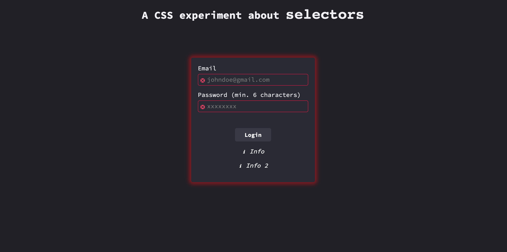
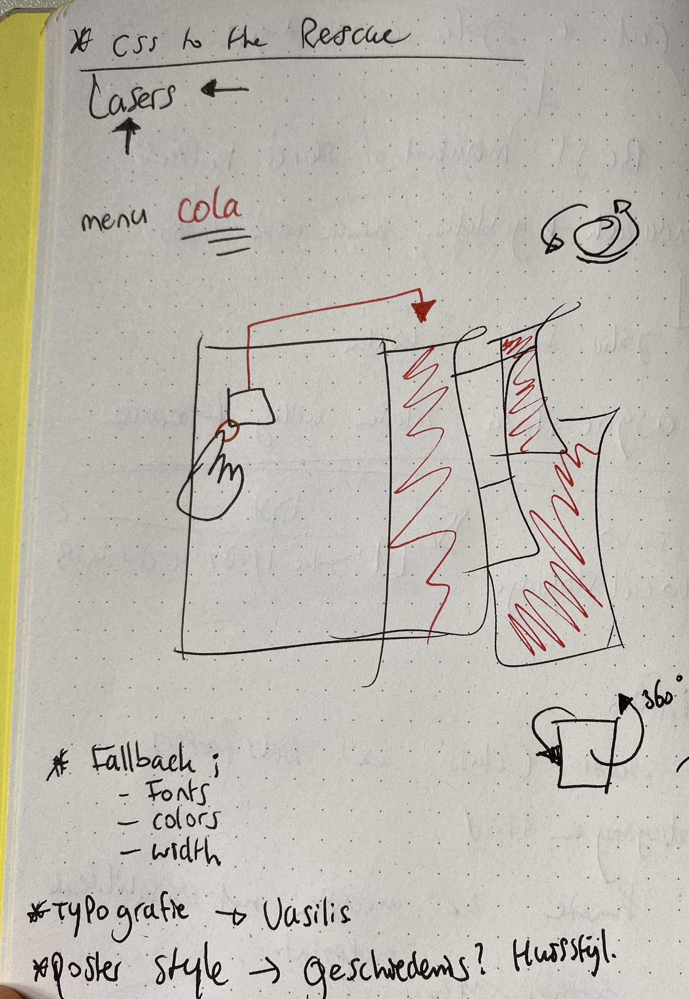
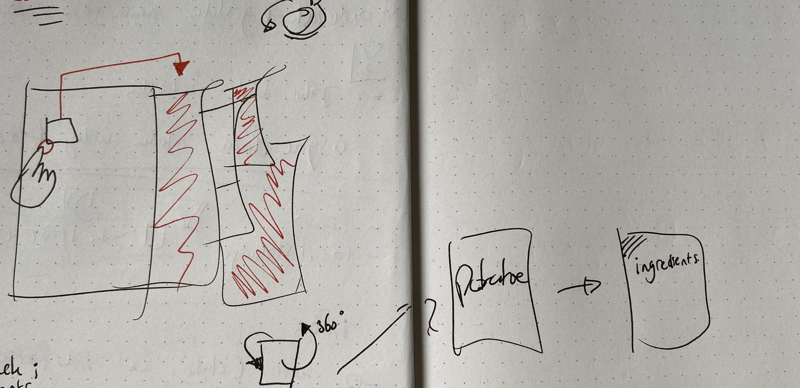
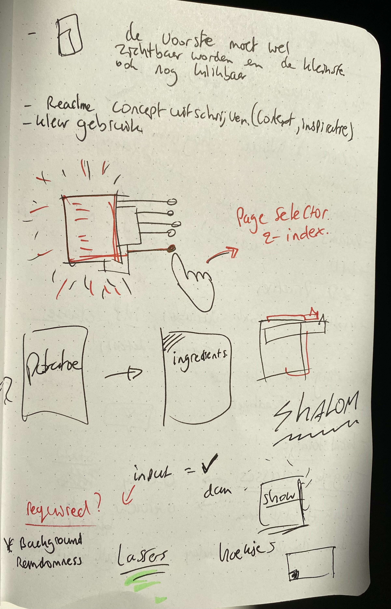
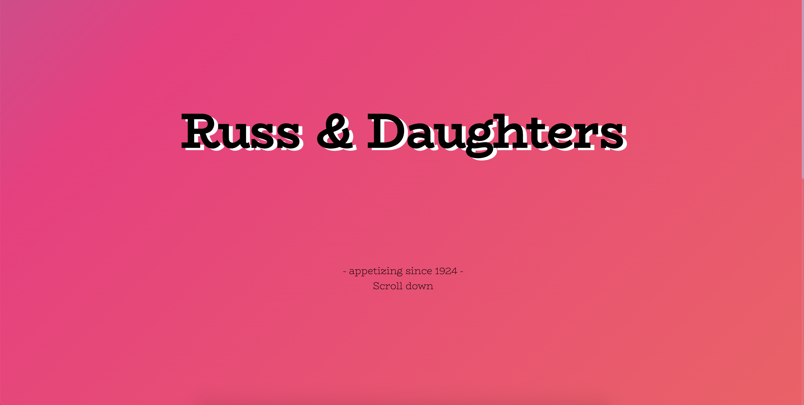
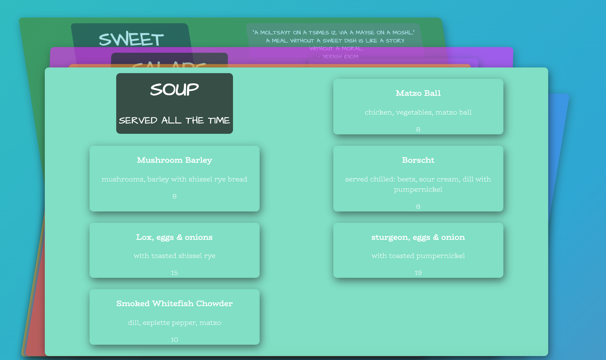
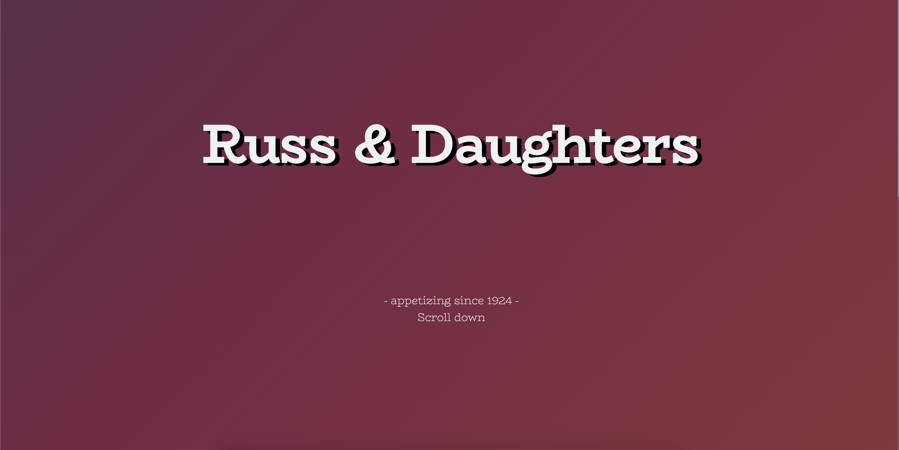
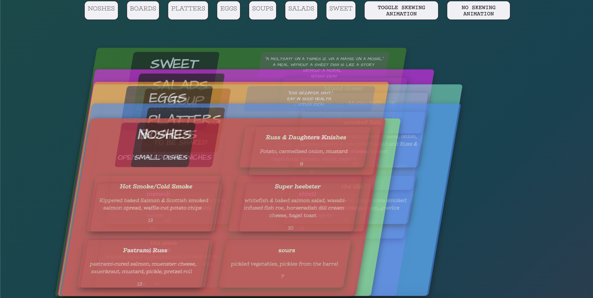

##### CSS to the Rescue @cmda-minor-web 2020 - 2021

  [](https://ralfz123.github.io/css-to-the-rescue-2021) [](shields.io)

### Table of Contents
<table style="margin-left: auto; margin-right: auto;">
    <tr>
        <td align="center"><a href="#rocket-purpose-of-project">🚀 Purpose of Project<a></td>
        <td align="center"><a href="#week-1">Week 1 👋<a></td>
        <td align="center"><a href="#week-2">Week 2 💻<a></td>
        <td align="center"><a href="#week-3">Week 3 💻<a></td>
        <td align="center"><a href="#week-4">Week 4 🚨<a></td>
        <td align="center"><a href="#gear-installation">⚙️ Installation<a></td>
        <td align="center"><a href="#file_folder-sources">📁 Sources<a></td>
        <td align="center"><a href="#cop-license">👮 License<a></td>
    </tr> 
</table>

## :rocket: Purpose of Project

Wij vinden het web fascinerend. De laatste jaren is CSS een volwassen en zeer krachtige taal geworden (niet langer een bottleneck - integendeel). Veel van de (nieuwe) **CSS-lekkernijen** worden echter nog niet ten volle benut. Sommige delen van de spec worden onterecht (nog) niet bemind, andere delen zijn zo groot en complex dat we mogelijkheden nog niet hebben doorgrond. Aan jou de  mooie opdracht om de onontgonnen delen van de CSS-wereld in kaart te brengen.

**In dit vierweekse vak ga je experimenteren met (voor jou) nieuwe CSS technieken - om daarna/mee een innovatieve, experimentele én aangename ervaring te creëren - met vanilla CSS en HTML dus (frameworks, preprocessors, libraries en JS zijn niet toegestaan).**

Nb. Het experiment wordt gewaardeerd - zelfs/zeker als het niet (helemaal) lukt. Voel je vrij om verder te gaan dan de CSS-technieken die je al beheerst.


### Opdrachten
Het vak bestaat uit:
- [Een kennismakingsoefening](https://cmda-minor-web.github.io/css-to-the-rescue-2021/oefening.html)
- [De eindopdracht](https://cmda-minor-web.github.io/css-to-the-rescue-2021/index.html)

De [beoordelingscriteria voor de eindopdracht](https://cmda-minor-web.github.io/css-to-the-rescue-2021/beoordelingsformulier.html) op een rijte.

### Leerdoelen
- Je kunt experimenteren met (voor jou) nieuwe css-technieken - om de mogelijkheden op waarde te schatten en te gebruiken waar gepast.
- Je hebt begrip van de volle kracht en mogelijkheden van CSS. Je laat zien dat CSS meer kan dan allen web pages 'stylen'.
- Je hebt begrip van de interactie-technieken van CSS (en HTML). De UX is aangenaam bruikbaar binnen de gekozen context(en).
- Je hebt begrip hoe progressive enhancement elegant toe te passen. Je laat zien dat je cascade, inheritance en specificity kunt toepassen.

[here](https://docs.google.com/spreadsheets/d/1Xv48MSiACNmnM6nXpGGUb8mJDC459uSaxJszO_zLEp8/edit?usp=sharing)

# Week 1

## Kickoff
Ik heb onderzoek gedaan naar selectoren en toen heb ik een loginpage gemaakt daarover. Die is [hier](https://ralfz123.github.io/css-to-the-rescue-2021/kickoff) te vinden. Wanneer je ingelogd bent, zie je hetgeen wat Shabier en Sjors gemaakt hebben.

Ik heb hier gebruik gemaakt en research gedaan naar de selectors **(parent selectors)** `:valid`, `:invalid`, `:focus-within` , maar ook pseudo selectors als `:hover`, `:focus` en pseudo elements als `:after`.

Hierdoor kwam ik achter de kracht van CSS.

Screenshot van hoe het login scherm eruit zag:


## Concept eindbeoordeling
Ik heb het het volgende concept bedacht:  
Ik wil de HTML content van het menu pakken en daar een bepaalde huisstijl aan toevoegen. Mijn ideeen gaan nu uit naar een Swiss style design en die wil ik helemaal uitspitten en vervolgens wil ik de gerechten op de kaartjes weergeven en wanneer je er overheen hovert, dan draait hij om en zie je de ingrediënten erop staan. Overigens wil ik ook nog een soort functie aan kunnen zetten dat het van het rustige swiss design omtovert naar een erg druk design.

## Context
Mijn keuze voor context is de **`prefers-color-scheme`**, omdat ik het uitdagend vind om 2 verschillende kleurthema's toe te passen. Overigens heb ik dit nog nooit gedaan, maar het lijkt mij zeker een uitdaging om dit een keer te doen. Dit brengt zeker ook wat bij aan de UX. Ik heb al een [resource](https://developer.mozilla.org/en-US/docs/Web/CSS/@media/prefers-color-scheme) gevonden van MDN waarin ze alles over dit principe uitleggen.

## Requirements
De eisen waar mijn product zich aan moet houden zijn:
- SVG toepassen in shapes, masks én filters
- Twee kleuren

## Inspiration

Voor de layout en design heb ik een Pinterest bord gemaakt waarop ik al mijn inspiraties pin. Het bord is [hier](https://nl.pinterest.com/ralfzonneveld/css-to-the-rescue-design-research/) te vinden.

De verschillende onderdelen wil ik op deze manier verwerken, dat als je op een gekleurde pagina drukt, dat hij dan zichbaar wordt (zie hieronder). ([Bron afbeelding](https://www.behance.net/gallery/61153051/One-Night-Only))


De manier waarop ik de cards wil laten zien staat hieronder ([Bron afbeelding](https://davisonpro.dev/)):


## Sketch




### Ideas for developing
- [ ] CSS programming for :hover over page and then z-index?
- [ ] Gridbox
- [ ] Animation


# Week 2
#### New Ideas:
- Slider/carousel in stead of paper-magazine
- Randomness color subjects
    - Media queries
- Title project
- Rotate menu's

## Nav
The navigation from inputs works now!

To-Do:
- [ ] Label for input
- [ ] Background image flip/animation.
- [ ] Dish cards flip


#### New sketches:



## Stiekem programmeren met CSS
Het is me eindelijk gelukt om dmv radio buttons een navigatie te maken en de cards te laten zien. Daarmee was ik erg aan het strugglen, maar nadat Vasilis zei dat ik de inputs in de root van de HTML moet zetten, konden de css selectors er wel bij en zo werkte de feature wel!

image before
image after

Leren werken met radial-gradient

# Week 3
labels andere plek want zijn door IDs gelink met hun input.

Idea:
- Intro scherm met de titel van het restaurant [uitgewerkt]
- Background image gradient met een animation. Gaaf effect. [uitgewerkt]
- pointer laser
- animatie maken --> gelukt als raket en dan hover over h1 en dan zal raket verschijnen en weggaan. --> moet alleen de classes weghalen en de animation mooier maken
- header interactie met animaties




Nice random effect als je op een card hebt geklikt en daarna op andere. Dan hebben ze allemaal een andere skew effect/richting.



`prefers-color-scheme` - Dark mode [uitgewerkt]:
- Background dark gradient
- Text color light (white)


- custom properties teovoeged (veradnerd wnr dark mode)




Het idee gekregen om een `media print` toe te passen zodat ze in restaurant het menu kunnen lezen.


# Week 4

***

## :gear: Installation
1. Clone the repository:  
```
git clone https://github.com/ralfz123/css-to-the-rescue-2021.git
```

2. To run the app   
```
python -m SimpleHTTPServer 8000  
```

3. Go to [localhost](http://localhost:8000/) in the browser
```
http://localhost:8000/
```

## :file_folder: Sources
Credits to [Sanne 't Hooft](https://github.com/shooft), Vasilis van Gemert, Thijs Spijker and Leonie Smits for giving interesting lectures about CSS and how to deal with it.


### LOREM sources
- **example** Lorem. (n.d.). Documentation Lorem. - Lorem Inc. Retrieved 28 December 2020, from https://Lorem.com/

### Other sources
<!-- - Stackoverflow (n.d.). Searching for answers on dev questions - Stackoverflow. Retrieved 02 February 2021 from https://www.stackoverflow.com -->

## :cop: License
[](https://opensource.org/licenses/MIT)  
This project from [Ralf](https://github.com/ralfz123) has a [MIT © License](https://github.com/ralfz123/css-to-the-rescue-2021/blob/main/LICENSE)
